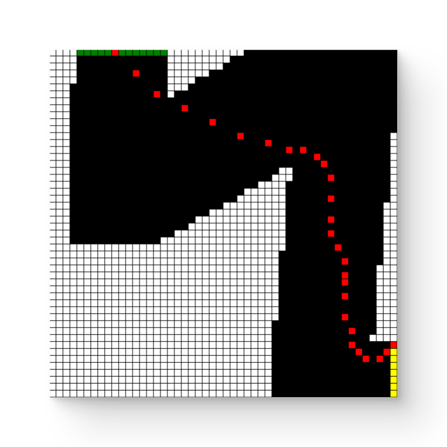
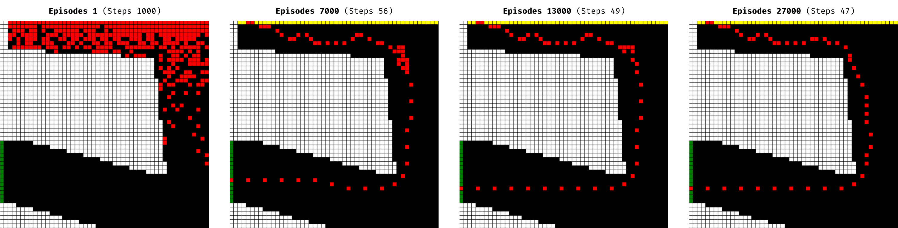
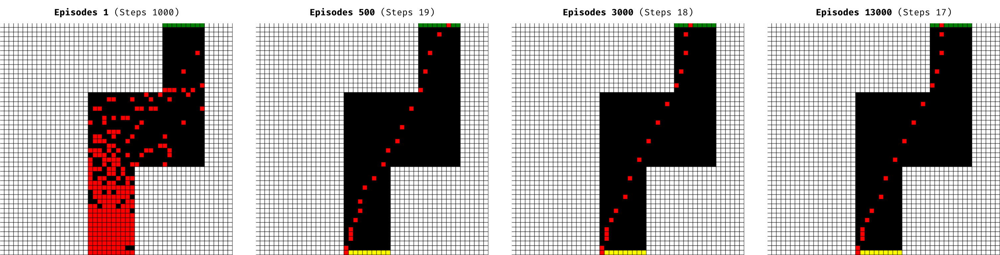
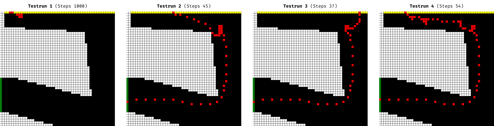
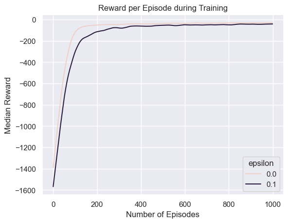
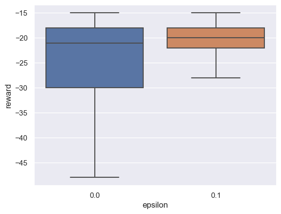
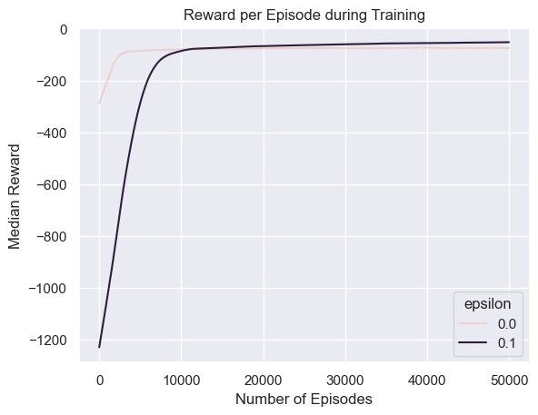
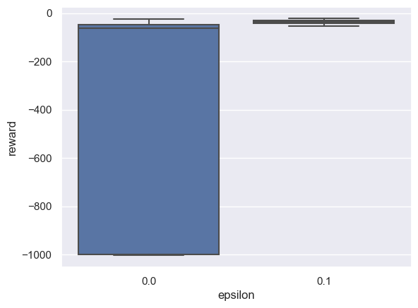

# Racetrack

Train an AI to drive on a simple racetrack, by using reinforcement learning with monte carlo.


*Figure 1: Example trajectory of a trained AI (red) on a racetrack (black)*


## Contents

- [Usage](#usage)
- [Scenario](#scenario)
- [Implementation](#implementation)
- [Results](#results)
- [Lessons Learned](#lessons-learned)
- [Credits](#credits)


## Usage

This project requires Python 3.10+ to be installed on your machine.

First install the dependencies with:

```console
pip install -r requirements.txt
```

Then start the main program `main.py` with:

```console
python main.py
```

You can customize the main program's behavior using the following command-line arguments:

- `--playstyle` or `-p`:
  - Choose the AI's playstyle.
  - Options:
    - `ai_static` (default): Train a model on one racetrack, and display test runs as static images.
    - `ai_interactive`: Train a model on one racetrack, and watch the AI play a game in real time.
    - `user`: Enable the user to play the game interactively via the command line.
- `--track-random` or `-tr`:
  - Generate a random racetrack with the specified seed.
  - Type: Positive integer.
  - Mutually exclusive with `--track-number`.
- `--track-number` or `-tn`:
  - Select a predefined racetrack.
  - Type: Integer (choose from available track numbers, use `--help` to see them).
  - Mutually exclusive with `--track-random`.
- `--episodes-to-train` or `-e`:
  - Specify the number of episodes to train the AI model.
  - Type: Positive integer (default 3000).
- `--preliminary-results` or `-pr`: 
  - Specify the number of episodes after which to show preliminary results during training.
  - Only for `ai_static` playstyle.
- `--final-results` or `-fr`:
  - Determine how many final games to display after training is complete.
  - Only for `ai_static` playstyle.
- `--help` or `-h`:
  - Show help message.

An example of this would be:

```console
python main.py -p ai_static -tr 42 -e 10000 -pr 1000 -fr 10
```

Additionally, there is the jupyter notebook [model_analysis.ipynb](model_analysis.ipynb) to create exploratory statistics and plots.


## Scenario

Consider a racetrack with discrete cells, like in *Figure 1*.
The goal for the racecar (red) is to drive as fast as possible from the start line (yellow) to the finish line (green), without crashing into the walls (white).

Each game begins at a random position on the start line.
At each timestamp the car can choose an action, to increase or decrease its velocity by 1 in any direction, or do nothing.
During training, there is a 10% chance that the chosen action is ignored.
If the car crashes into the wall its position is reset to a random position on the start line.

## Implementation

### Fundamentals

*Reinforcement Learning* is a technique where an AI (also referred as model or agent) takes actions, and receives rewards as feedback.
The AI's goal is to maximize the reward.
It learns which actions are the best by playing lots of games. 

*Q-Learning* is a specific type of Reinforcement Learning.
It is model-free, meaning it doesn't require prior knowledge of the game rules.
In the context of the racetrack problem, this means the AI does not know the rules of the game, and instead learns them by trial and error.
"Q" refers to the function that stores the expected reward for each state-action pair calculated by the algorithm.

*Q-Learning with Monte Carlo* is a specific form of Q-learning, and our chosen approach.
The AI learns from sampled experience, thus it plays only a subset of all possible ways of playing a game.
Learning occurs after playing an entire game episode.
A similar approach, that we do not use in this project, is *temporal difference learning*, where the AI learns after each individual step rather than after completing a full game.

### Architecture


The game starts on a predefined or randomly generated racetrack.

The AI takes an action to influence the velocity and receives the new state & corresponding reward.
By playing lots of games the AI learns which actions are best for each state.

The Visualizer can visualize the game live as the AI plays or shows a summary of the finished game.

### Model

We use an optimistic first-visit monte carlo model, with an epsilon greedy strategy.
Here's a breakdown of its key characteristics:

* Optimistic: Prioritizes actions with unknown rewards, over actions with known rewards.
* First visit: Considers only the first occurrence of a state-action pair within an episode.
* Monte Carlo: Learns from sample experience, thus it plays only a subset of all possible ways of playing a game.
* Epsilon greedy: Occasionally selects a random action (10% chance) during training instead of the best action.

Environment specifics:
* During training, there is noise (10% chance of ignoring an action).
* The car starts at a random position on the starting line.

Reward scheme:
* -1 for each step taken.
* -5 for going off the track (beneficial for complex tracks).

Keep in mind that randomness plays a role in both the model and the environment.

### Racetrack

The racetrack is internally represented by a 2-dimensional numpy array, with integer values indicating cell types:
- 0 = OFF_TRACK
- 1 = ON_TRACK
- 2 = START
- 3 = FINISH

Racetracks can be predefined or randomly generated using a generator.
Predefined tracks are defined in `classes/racetrack_list.py`.
Random tracks are created by choosing random points on a grid, followed by randomly assigning the start and finish points. Lines are then drawn to connect these points using OpenCV.


## Results

### Visualize Played Games

#### Training Process on Complex Racetrack



Here we see how a model performs after training a certain number of episodes.
Initially, the model performs quite badly and does not reach the finish line (green).
As more episodes are played, the model's performance improves, and its path gets smoother.

Replicate with: `-tr 42 -e 30000 -pr 1000 -fr 0`

#### Training Process on Simple Racetrack



Here we see the training progress on a simpler racetrack.
The model quickly learns to drive to the finish line, but requires substantial training time to achieve improvements, eventually appearing to reach a plateau.

Replicate with: `-tn 1 -e 50000 -pr 500 -fr 0`

#### Testruns on Complex Racetrack



Here are 3 games of a fully trained model. 
Due to the random nature of the game, the starting positions vary.
The same model successfully reaches the finish line in three games (Testrun 2,3 and 4), but with one instance (Testrun 1) it gets stuck in a loop, failing to reach the finish line.
This demonstrates that looking at one game alone just doesn't show the whole picture.

Replicate with: `-tr 42 -e 5000 -fr 4`

### Analyzing Reward per Episode

We measured rewards for games (aka episodes) played by 2 models:
- The greedy model always chooses the best action (ε=0)
- The epsilon-greedy model takes a random action with a 10% chance (ε=0.1)

In this context higher, rewards indicate that the game was finished faster.

We measured the median reward of multiple models, to limit the influence of randomness, and smoothed the lineplots with lowess, for more clarity.
The source code is in [model_analysis.ipynb](model_analysis.ipynb).

#### Simple Racetrack

First we analyze the rewards on a simpler racetrack (track number 1).



During training the greedy model (ε=0) performs better. 
This is a bit unexpected to us since we expected that exploring more options (ε=0.1) would lead to higher rewards.
Additionally, both models improve as more episodes are played



When testing the trained models, both models perform similarly on average. 
Although the greedy model (e=0%) has a higher variance.

#### Complex Racetrack

Next we analyze the rewards on a more complex racetrack (random track with seed 42).



During training, the greedy model appears to reach a plateau, while the epsilon-greedy model steadily improves and consistently outperforms the greedy model after around 10000 episodes.



When testing the trained models, the epsilon-greedy model outperforms the greedy model. 
On average, the greedy model is nearly as good as the epsilon-greedy.
However, there seem to be many cases where the greedy model performs very badly, sometimes even failing to reach the finish line.

## Lessons Learned

Here are some key takeaways from our project:
- Exploration is beneficial (epsilon-greedy performs better than just greedy, especially on complex maps, and interestingly is sometimes worse just during training)
- Extra penalties can improve performance (e.g. for going off-track)
- Be mindful of randomness (we unintentionally trained 10x with the same seed…)
- Long training times (especially on complex maps)
- The approach is limited (this style of q-learning seems to be limited e.g. saving lots of states, struggles with simple maps)
- There is much to explore (e.g. different values of epsilon, testing many more tracks, more advanced algorithms like giving the agent vision of its surroundings)
- This field and task is quite creative (e.g. what rewards to choose, how to structure the algorithms)
- Reinforcement learning is broader than expected e.g.:
  - [Nuclear Fusion (control tokamak plasmas)](https://www.deepmind.com/publications/magnetic-control-of-tokamak-plasmas-through-deep-reinforcement-learning)
  - [Cooling Datacenters](https://arxiv.org/pdf/2211.07357.pdf)
  - [Designing Chips](https://doi.org/10.1038/s41586-021-03544-w)
  - [ChatGPT (RLHF)](https://huggingface.co/blog/rlhf)


## Credits

This project was created by students as part of a lecture at the *Vienna University of Technology*.
It is inspired by an exercise in the book *Reinforcement Learning: An Introduction by Andrew Barto and Richard S. Sutton* on page 111.

Negar Alinaghi, Benjamin Probst, Lukas Wieser • 12.10.2023
