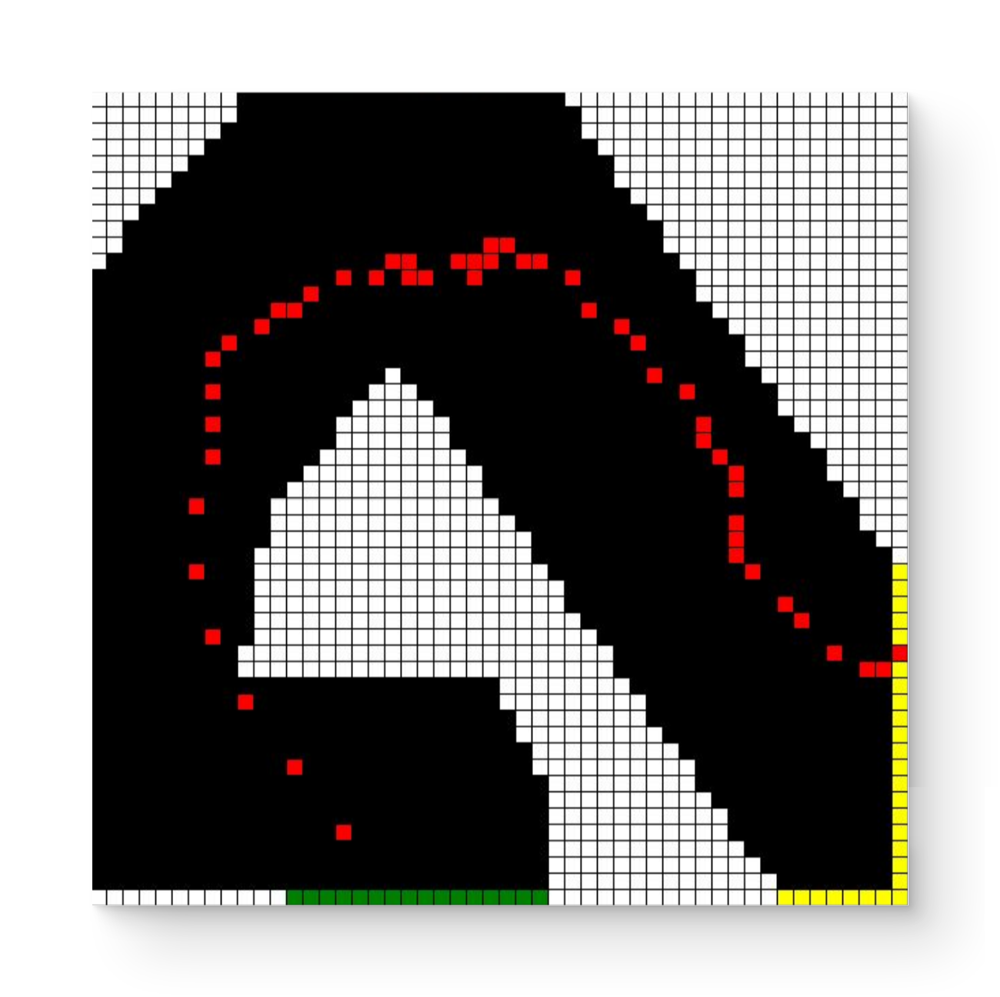
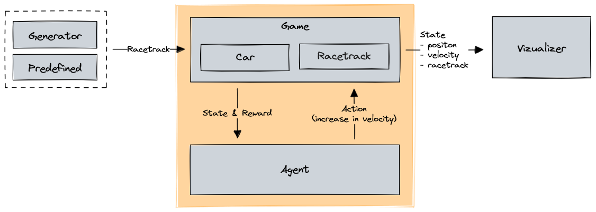
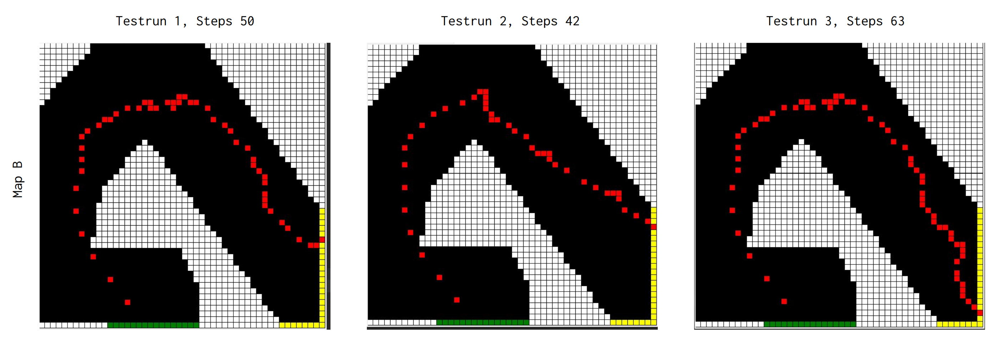
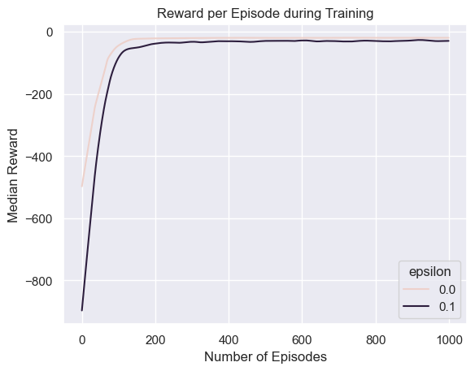
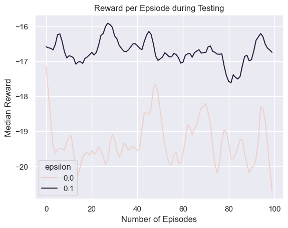
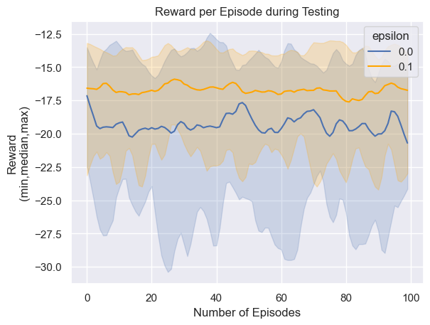

# Racetrack

Train an AI to drive on a simple racetrack, by using reinforcement learning with monte carlo.


*Figure 1: Example trajectory of a trained AI (red) on a racetrack*


## Contents

- [Usage](#usage)
- [Scenario](#scenario)
- [Implementation](#implementation)
- [Results](#results)
- [Lessons Learned](#lessons-learned)
- [Credits](#credits)


## Usage

This project requires Python 3.10+ to be installed on your machine.

First install the dependencies with:

```console
pip install -r requirements.txt
```

Then start the main program `main.py` with:

```console
python main.py
```

You can use the following command-line arguments to customize the behaviour of the main program:

- `--playstyle` or `-p`:
  - Choose the AI's playstyle:
    - `ai_static` (default): Train a model on one racetrack, and display test runs as static images.
    - `ai_interactive`: Train a model on one racetrack, and watch the AI play a game in real-time.
    - `user`: Enable the user to play the game interactively via the command line.
- `--track-random` or `-tr`:
  - Generate a random racetrack with the specified seed.
  - Type: Positive integer.
  - Mutually exclusive with `--track-number`.
- `--track-number` or `-tn`:
  - Select a predefined racetrack.
  - Type: Integer (choose from available track numbers, use `--help` to see them).
  - Mutually exclusive with `--track-random`.
- `--episodes-to-train` or `-e`:
  - Specify the number of episodes to train the AI model.
  - Type: Positive integer (default 3000).
- `--preliminary-results` or `-pr`: 
  - Specify the number of episodes after which to show preliminary results during training.
  - Only for `ai_static` playstyle
- `--final-results` or `-fr`:
  - Determine how many final games to display after training is complete.
  - Only for `ai_static` playstyle
- `--help` or `-h`:
  - Show help message

An example of this would be:

```console
python main.py -p ai_static -tr 42 -e 10000 -pr 1000 -fr 10
```

Additionally, there is the jupyter notebook [model_analysis.ipynb](model_analysis.ipynb) to create exploratory statistics and plots.


## Scenario

Consider a racetrack with discrete cells, like in *Figure 1*.
The goal for the racecar (red) is to drive as fast from start line (yellow) to the finish line (green), without crashing into the walls (white).


Each game begins at a random position on the start line.
At each timestamp the car can choose an action, to increase/decrease its velocity by 1 in one direction, or do nothing.
During training, there is a 10% chance that the chosen action is ignored.
If the car crashed into the wall its position is reset to the start line.

## Implementation

Reinforcement Learning is a technique where an agent (aka model aka AI) takes actions, and receives a reward as feedback.
By playing lots of games it learns which actions are best for which state.

Specifically, the model plays an episode (aka game), and saves for each step the state, action, and reward.
After the episode it computes the discounted average reward for each state-action pair, and saves them.
This expected reward is the reward that the agent can expect to get at the end of the game if it is in the specified state and applies the specified action.
And this is how the model learns! 
Since it can look up for each state, all actions and their expected reward, and choose the action with the highest reward.

This approach is called *Q-Learning*.

### Architecture



The game is started with a predefined or randomly generated racetrack.

Then the AI takes an action to influence the velocity and gets the new state & a matching reward back.
By playing lots of games it learns which actions are best for which state.

The Visualizer can visualize the game live as the AI plays or shows a summary of the finished game.

### Model

We use an optimistic first-visit monte carlo model, with an epsilon greedy approach:

* optimistic (prioritize actions with unknown rewards, over actions with known rewards)
* first visit (if the same state-action pair occurs multiple times in one episode, just take the first into account)
* monte carlo (the agent learns from sample experience aka it plays only a subset of all possible ways of playing a game)
* epsilon greedy (during training pick with a 10% chance a random action instead of the best action)

Environment:
* is noisy during training (i.e. 10% chance of ignoring action)
* random position on the start line

Rewards:
* -1 for each step
* -5 if out of track (seems to be beneficial for complex tracks)

Keep in mind that the model and environment/game have randomness in them.

### Racetrack

The racetrack is internally represented by a 2-dimensional numpy array. The elements of this array are integers, and specify the type of the cell:
- 0 = OFF_TRACK
- 1 = ON_TRACK
- 2 = START
- 3 = FINISH

There are predefined racetracks in `classes/racetrack_list.py` and 
the option to randomly create racetracks with a Generator.

Racetracks are generated by choosing a given number of random points on a grid.
Then the start and finish points are selected randomly. 
Finally, the points are connected with lines using opencv.


## Results

### Visualize Played Games


Here we see how a model performs during training, after 0, 500, 2500, and 500 episodes are played.
With more episodes played, the model gets better and reaches the finish line (green).
Keep in mind that a model with more games played can also perform worse, due to randomly having a worse starting position.



Here we see 3 games of a trained model on the same racetrack.
Due to the random nature of the game, the path is always a bit different.

### Reward per Episode

We measured rewards for games (aka episodes) played by 2 models.
The greedy model always chooses the best action (ε=0), while the exploration model takes a random action with a 10% chance (ε=0.1).

We measured the median reward of multiple models, to limit the influence of randomness, and smoothed the plots with lowess.
The source code is in [model_analysis.ipynb](model_analysis.ipynb).



During training the ε=0 model performs better. This is a bit unexpected to us since we expected that exploring more options (ε=0.1) leads to better rewards.
Also, the more episodes are played, the better the models become.



During testing trained models, the ε=0.1 model consistently performs better, so exploration seems to pay off.



During testing the greedy model (ε=0) has not only worse rewards but also a higher variance.

## Lessons Learned

Here are some key takeaways from our project:
- Exploration is beneficial (ε=10% performs better than 0%, when testing!)
- Extra penalties can imrpove performance (e.g. for going off-track)
- Be mindful of randomness (we unintentionally trained 10x with the same seed…)
- Long training times (especially on complex maps)
- The approach is limited (this style of q-learning seems to be limited e.g. saving lots of states, struggles with simple maps)
- This field and task is quite a creative (e.g. what rewards to choose, how to structure the algorithms)
- Reinforcement learning is broader than expected e.g.:
  - [Tokamak Nuclear Fusion (plasma controller)](https://www.deepmind.com/publications/magnetic-control-of-tokamak-plasmas-through-deep-reinforcement-learning)
  - [ChatGPT (RLHF)](https://huggingface.co/blog/rlhf)


## Credits

This project was created by students as part of a lecture at the *Vienna University of Technology*.
It is inspired by an exercise in the book *Reinforcement Learning: An Introduction by Andrew Barto and Richard S. Sutton* on page 111.

Negar Alinaghi, Benjamin Probst, Lukas Wieser • 14.08.2023
